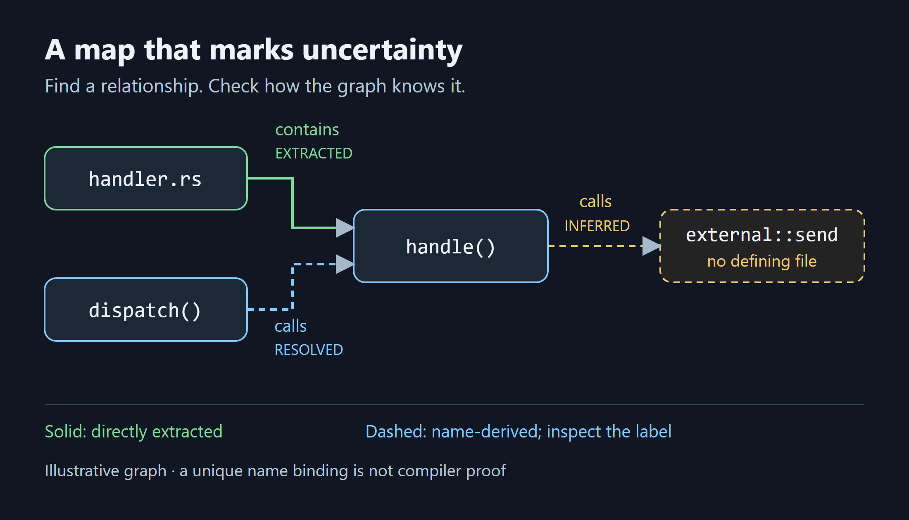
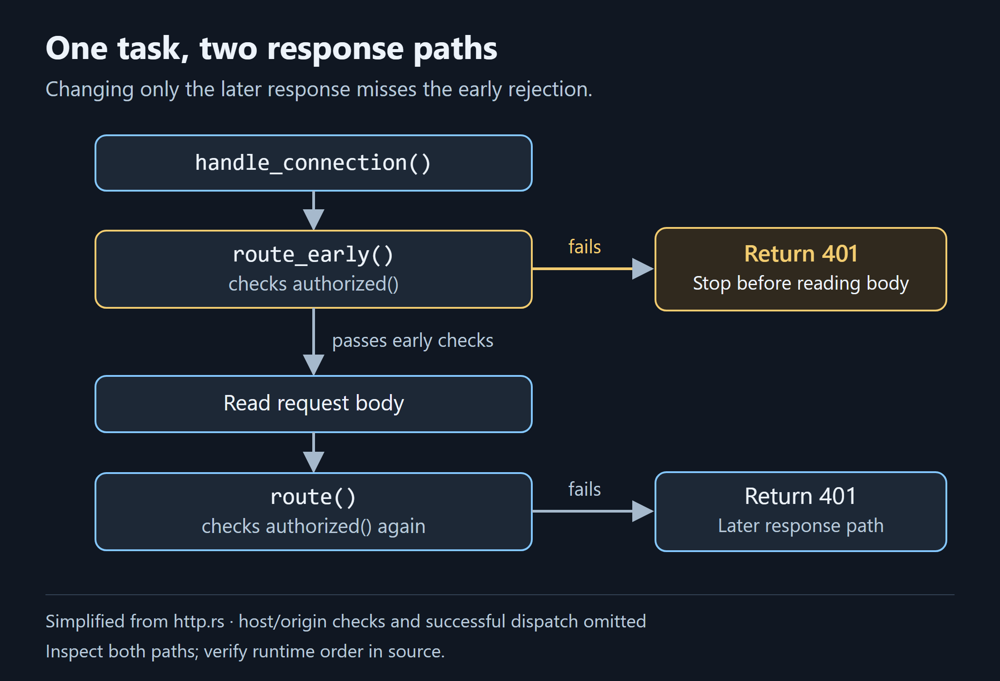
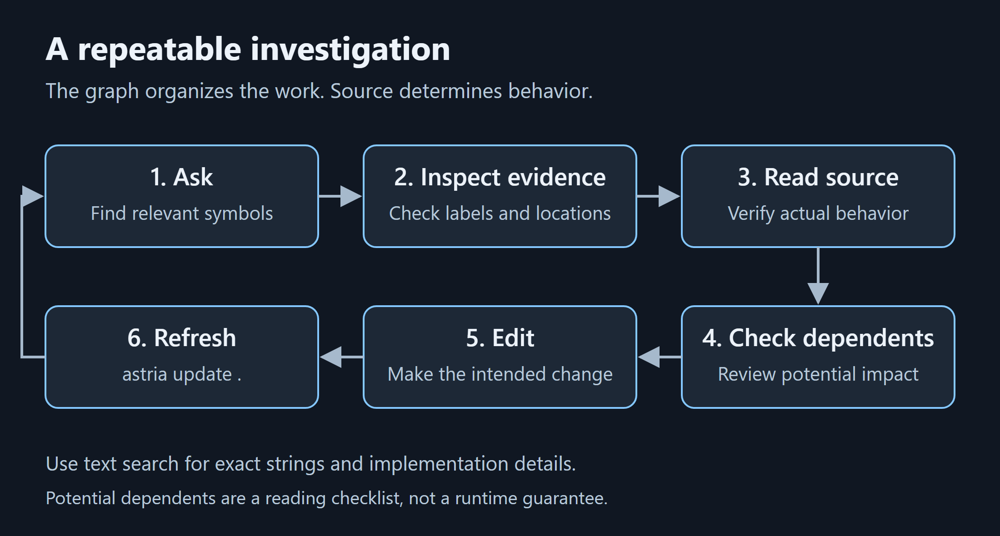

<!-- Publishing instructions and image manifest: README.md. Remove this comment before publishing. -->
<!-- Medium topics: Programming; Artificial Intelligence; Developer Tools; Knowledge Graphs; Software Engineering. Select matching available topics. -->

# Your Coding Agent Is Guessing. Give It a Map.

## Find the relevant code, inspect its relationships, and check what might depend on a change.

*By the [Nodesify](https://nodesify.com) team · October 2026*

*Disclosure: we build and maintain Astria. The examples and measurements below come from our own development work.*

## The ritual

A coding agent lands in an unfamiliar repository. It searches for a keyword, reads a few files, then searches for names it found inside them. Sometimes that is enough. Sometimes it spends several rounds reconstructing a call chain before it can decide where to make a change.

Text search is good at finding text. The harder questions concern relationships: which module owns this behavior, which callers depend on it, and whether two identically named functions are actually connected.

Compilers and language servers can supply some of that structure. Coverage depends on the language and tooling; runtime dispatch can still leave uncertainty. An agent working through file reads and search must reconstruct much of it for itself.

We built [Astria](https://github.com/Nodesify/astria) at [Nodesify](https://nodesify.com) to help coding agents navigate unfamiliar repositories through a local, queryable graph. It helps an agent locate relevant code and inspect connections before editing. The graph also needs to disclose when a connection is inferred, unresolved, or stale.

## What a map adds



*Solid edges show directly extracted structure. Dashed edges show name-derived relationships; their labels distinguish resolved bindings from unresolved targets.*

Astria stores a graph in SQLite under `.astria/`. Nodes represent functions, types, files, packages, document sections, and unresolved names. Edges represent relationships such as containment, calls, imports, and uses.

Each edge carries an evidence label, with source locations where available. A file containing a function is directly extracted structure. A call bound by matching names and scopes is name inference, even if there is only one candidate. An unresolved name should remain visibly unresolved.

That distinction makes the map inspectable. It also means a graph query is a starting point for reading source, rather than an authority on runtime behavior.

Structural extraction uses Rust and tree-sitter and needs no API key. Local embeddings and remote semantic enrichment are optional. The registry contains 42 language configurations, with different extraction coverage by language; see the [language-support table](https://nodesify.github.io/astria/docs/reference/language-support).

## Build your first graph

With **Node.js 22 or newer**, run these commands from your repository:

```sh
npm install -g @nodesify/astria
astria run .
astria map
```

Verify that the installation is available in the terminal where you will use it:

```sh
astria --version
```

For the release described here, this prints `1.1.0`. A newer installation may print a different version. After `astria run .`, check that `.astria/graph_report.md` exists and that `astria map` returns repository content. If the command is missing, reopen the terminal and check your npm global executable directory is on `PATH`. If the map is empty, check the indexed directory and the language-support table before investigating retrieval quality.

Prebuilt native binaries are distributed for supported platforms, so npm installation needs no Rust toolchain. Build time depends on repository size, hardware, and enabled features.

The map provides a ranked orientation view. For a specific question, query the graph:

```sh
astria query "where is bearer token authentication for the http mcp server implemented"
```

On astria's own repository, relevant results include `http.rs`, `HttpServerConfig`, and the native entry point `run_mcp_http_server()`. Returned node IDs let you inspect connections with `astria explain`; source locations point you toward the implementation.

If the output warns that indexed files have changed, refresh with `astria update .` and repeat the query. Updates reuse extraction caches for unchanged files and reconcile references across the current corpus. Use IDs and locations from the refreshed results.

## One task, two response paths

Suppose you want to change the unauthorized response returned by the HTTP MCP server. Finding the server entry point is useful, but it does not yet tell you which function chooses that response.

Reading the [HTTP server source at the evaluated commit](https://github.com/Nodesify/astria/blob/5e69c63cee176a7addc3b5c4414280bba3d2d815/crates/astria-mcp/src/http.rs#L518) reveals an important detail:



*Simplified from the source. Host and origin checks are omitted. The early rejection returns before body reading and the later route call.*

Both `route_early()` and `route()` invoke `authorized()` and construct a 401 JSON response on failure. The live connection handler calls `route_early()` before reading the request body. Editing only the later `route()` response would miss the response actually returned for a rejected request.

That is the distinction the investigation needs to uncover. A graph helps locate and inspect relationships; following the source establishes the ordering and behavior.

Before editing, find both symbols and inspect their dependents:

```sh
astria query "route_early route authorized http.rs"
astria explain <node-id-from-your-query>
astria affected <route-early-node-id-from-your-query>
astria affected <route-node-id-from-your-query>
```

Replace the angle-bracketed arguments with IDs returned by your query. `affected` follows incoming dependency relationships to identify potential callers and other dependents. Use those results as a reading checklist: missing bindings can hide dependencies, and inferred bindings can add false positives. Reachability does not establish what executes at runtime.

For this task, source inspection points to keeping both unauthorized-response paths consistent and checking the connection handler's early rejection. After editing, refresh the graph with `astria update .`.

## Make the workflow available to your agent



*The graph organizes the investigation. Source inspection determines behavior; refreshing keeps the next investigation current.*

The CLI and MCP server share a retrieval engine. MCP—the Model Context Protocol—lets an agent call tools exposed by a server. Astria's tools include `repo_map`, `query_graph`, `explain`, `shortest_path`, and `affected`.

There are two setup steps: connect the tools, then teach the agent when to use them. For Codex, run this from the repository after building the graph:

```sh
astria install --platform codex
```

The installer writes the skill and repository instructions, and registers the MCP server in Codex's user-level configuration. Start a new agent session and check that the tools appear. Other supported platforms have their own installation paths in the [agent-integration guide](https://nodesify.github.io/astria/docs/guides/mcp-and-agents).

Repository instructions should make the intended behavior explicit:

```markdown
- Orient with repo_map or astria map.
- Query for relevant symbols and inspect evidence labels.
- Verify important results against source.
- Check affected before changing a shared symbol.
- Refresh with astria update . after edits.
- Use text search for exact strings and implementation details.
```

An instruction file alone does not connect an MCP server. Conversely, available tools do not ensure the agent will use them well. Both parts matter.

## Trust the evidence, then check it

We learned why uncertainty matters through a bug in our own graph. Speculative nodes incorrectly borrowed defining-file locations from files that referenced them. Fixing that defect removed **743 phantom file dependencies and four false cycles**, while the measured retrieval score on the question set stayed unchanged. Useful search results had concealed incorrect structure. The [release record](https://github.com/Nodesify/astria/blob/c7789947c8d876aef6a66537ff0aa248560f3c08/CHANGELOG.md#L15-L20) documents these observations; the [fix commit](https://github.com/Nodesify/astria/commit/97a83dc605c154bea9362722107045fa843a9e74) shows the implementation.

That is why evidence labels and source verification belong in the workflow. A relationship can be useful without being certain. Strict traversal with `--detail high` retains only `EXTRACTED` and `DECLARED` edges; it also excludes useful name-derived `RESOLVED` calls, and does not guarantee completeness.

Our October 6 paired evaluation against Graphify found higher file MRR for astria on 7 of 8 corpus/split conditions, while Graphify built faster on 7 of 8. The sets were small and previously exercised. These retrieval measurements do not establish savings over a skilled search workflow or the cost of a completed agent task. The [full evaluation](https://nodesify.github.io/astria/docs/explanation/retrieval-validation) documents the tradeoffs and limitations.

## Try a question you can verify

Choose a repository you know and ask, “What calls this handler?” or “Which modules depend on this package?” Compare the graph's relationships with the source. That gives you a practical way to judge whether the map helps your work.

Use graph queries for relationships and potential change impact. Use text search for exact error messages and configuration keys. Read implementation details to understand behavior. Keep the graph current as the code changes.

A useful map helps you decide where to look. A trustworthy one also marks the places it cannot resolve.

Try [Astria's getting-started guide](https://nodesify.github.io/astria/) on a repository you know, then verify one relationship against its source. The [open-source repository](https://github.com/Nodesify/astria) contains the implementation and contribution guidance. Follow Nodesify on Medium for the companion articles on graph correctness and evaluation.

## Related approaches

[Graphify](https://github.com/Graphify-Labs/graphify) also makes repository relationships available to coding agents; its [Claude Code guide](https://graphify.com/blog/how-to-give-claude-code-a-code-knowledge-graph) describes a platform-specific setup. GitHub's [stack graphs](https://github.blog/open-source/introducing-stack-graphs/) tackle name binding through language-specific rules and constrained graph paths. Astria's name-derived bindings should not be equated with that resolution mechanism. A graph interface alone does not establish the precision of its relationships.

## References and further reading

- [Your Code Graph Can Invent Dependencies](2026-10-your-code-graph-can-invent-dependencies.md)
- [How We Evaluate Code Retrieval Tools](2026-10-how-we-evaluate-code-retrieval-tools.md)
- [Astria documentation](https://nodesify.github.io/astria/) and [source](https://github.com/Nodesify/astria)
- [HTTP request handling at the evaluated source commit](https://github.com/Nodesify/astria/blob/5e69c63cee176a7addc3b5c4414280bba3d2d815/crates/astria-mcp/src/http.rs#L518)
- [October 6 evaluation evidence and reproduction notes](evidence/2026-10-06/README.md)

<!-- PUBLISH: replace the local evidence link with the public evidence-package URL and companion links with published article URLs; see README.md. -->

*About Nodesify: [Nodesify](https://nodesify.com) is a Malaysia-based custom software development and IT consulting company, and the team behind [Astria](https://github.com/Nodesify/astria).*

*Astria is MIT-licensed and independently implemented, inspired by Graphify without affiliation or endorsement.*
