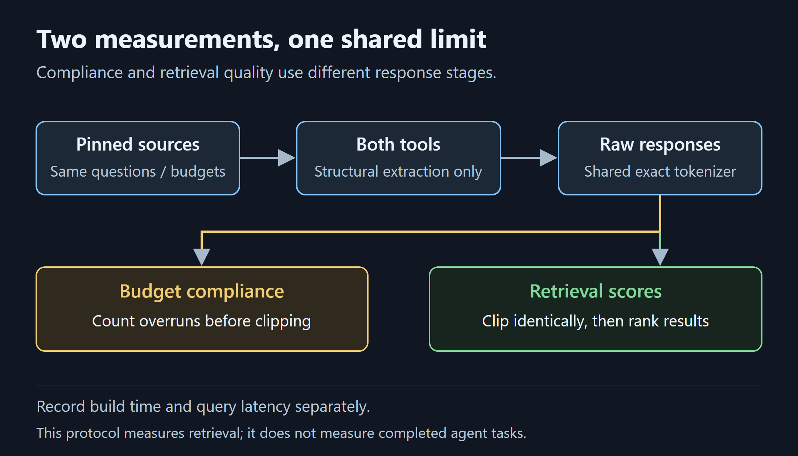

<!-- Publishing instructions and image manifest: README.md. Remove this comment before publishing. -->
<!-- Medium topics: Information Retrieval; Benchmarking; Artificial Intelligence; Developer Tools; Software Engineering. Select matching available topics. -->

# How We Evaluate Code Retrieval Tools

## File hits, exact definitions, token budgets, and build time answer different questions. None alone establishes a better coding agent.

*By the [Nodesify](https://nodesify.com) team · October 2026*

*Disclosure: we build and maintain Astria and ran this comparison ourselves. It is not an independent evaluation.*

## Start with the question the benchmark can answer

When a code graph returns a relevant file, what have we learned? We know something about retrieval. We have not yet established whether an agent can understand the implementation, make the right change, or complete the task for fewer tokens.

At [Nodesify](https://nodesify.com), our evaluation of [Astria](https://github.com/Nodesify/astria) separates several measurements: file ranking, exact declaration retrieval, output-budget compliance, query latency, and graph build time. Keeping them separate exposes tradeoffs that one headline score would hide.

This article explains our **October 6, 2026 paired run: astria 1.1.0 versus Graphify 0.9.77**. It is a local retrieval comparison with small, previously exercised question sets, not evidence of broad superiority.

All numerical results below come from the [saved run report](evidence/2026-10-06/report.md). The accompanying [evidence package](evidence/2026-10-06/README.md) includes machine-readable summaries, the original raw results, exact question inputs, and reproduction instructions.

<!-- PUBLISH: replace evidence-package and report links with their public URLs before release. These files are prepared locally, not yet published. -->

## What was held constant

Both tools received fresh archives of the same pinned repository sources. We used structural extraction only: no LLM enrichment and no embeddings. Queries used breadth-first traversal at depth two, with 1,000- and 4,000-token budgets.

Responses were counted with a shared exact `o200k_base` tokenizer. For scoring, both tools' outputs were clipped using the same complete-line rule. Raw budget overruns were recorded **before clipping**, so a tool could not hide noncompliance behind the evaluator's truncation.



*Budget compliance describes the raw response. Retrieval scores describe the response after the evaluator applies the shared limit.*

The run covered four repositories: astria itself, Click, Express, and ripgrep. Frozen, corrected, and additional-validation splits produced **eight corpus/split conditions**. The self splits contained 35 questions each; external splits contained two or three. Across splits, there were 85 question responses per budget per tool. These are not 85 independent tasks, or eight independent repositories.

The machine was Windows with a Ryzen AI 9 HX 370, Node 24, and Python 3.12.12. Each condition had one observation; query timings included process startup. The [full methodology](https://nodesify.github.io/astria/docs/explanation/retrieval-validation) records source pins and additional details.

## Reproduce the protocol

The evaluated Astria source and self corpus were pinned to [`5e69c63`](https://github.com/Nodesify/astria/tree/5e69c63cee176a7addc3b5c4414280bba3d2d815); Graphify was pinned to [`5c7b847`](https://github.com/Graphify-Labs/graphify/tree/5c7b84792f453582676548185aaec3824d51dfe2). The evidence package records full commits for Click, Express, and ripgrep, question-file hashes, and hashes of the measured CLI and native binary.

Build Astria from the pinned source, install its CLI dependencies and `js-tiktoken`, and install the pinned Graphify checkout into a dedicated Python environment. Copy the supplied configuration template to `config.local.json` in the evidence directory, then set your Python, Graphify, native-library, CLI, and corpus paths. Use a new output directory for each run. From the Astria repository root:

```sh
node scripts/bench/paired/run.mjs medium/evidence/2026-10-06/config.local.json
node scripts/bench/paired/report.mjs bench-work/medium-reproduction-20261006/results.json
```

The second command assumes the template's output path is unchanged. Platform-specific preparation and the eight measured splits are explained in the [reproduction notes](evidence/2026-10-06/README.md) and [pinned runner instructions](https://github.com/Nodesify/astria/blob/5e69c63cee176a7addc3b5c4414280bba3d2d815/scripts/bench/paired/README.md). The package contains no reserved question sets. A fresh run produces new measurements; timings and rankings need not match this single historical observation. We have prepared these instructions from the saved configuration and runner, rather than performing a fresh benchmark for this article revision.

## Finding the file versus finding the function

**File recall@5** measures how much of the expected file set appears among the first five distinct returned files. **File MRR**, or mean reciprocal rank, rewards placing a relevant file earlier: first place contributes 1, second place ½, and so on.

**Definition recall@5** checks expected declarations among the first five returned nodes. That distinction matters when one file contains several methods with the same name. A file hit can look successful while the required declaration is absent from the useful part of the response.

For the frozen self-corpus split:

```text
35 questions             astria        Graphify
File recall@5 / MRR
1,000-token budget       75.7% / .570  55.7% / .464
4,000-token budget       78.6% / .586  55.7% / .464
```

Across all eight corpus/split conditions, astria had higher file MRR in **7 of 8**. Graphify led on the frozen ripgrep split. Both tools achieved 100% file recall@5 on the frozen Click, Express, and ripgrep splits.

Exact definitions were harder. On frozen Click, definition recall@5 was **60% for astria and 0% for Graphify**. On the additional ripgrep validation split, it was **50% and 0%**. Astria's remaining misses matter: retrieving a relevant file does not guarantee the agent receives the exact symbol it needs.

These are retrieval scores computed from tool outputs. This paired run did not measure generated-answer correctness or completed code changes.

## Budget compliance is its own result

An output budget only helps if the response respects it. We count raw responses separately from the clipped responses used to evaluate retrieval:

```text
85 responses per budget, per tool
                         astria        Graphify
Over 1,000 tokens        0 / 85        59 / 85
Over 4,000 tokens        0 / 85        50 / 85
```

At a hard context limit, an overlong response needs truncation before delivery. The evaluator applies the same clipping to both tools, but raw compliance still describes an operational difference. It is not equivalent to proving lower total task cost: an agent may need additional queries and source reads.

Nor should output tokens be confused with a graph builder's full-read comparison. Astria's build report can show an illustrative **244.6×** ratio between estimated corpus size and average sample-query output. That calculation uses a bytes-divided-by-four heuristic and compares with reading the entire indexed corpus. It is not the exact tokenizer measurement above, a targeted-search comparison, or a measurement of end-to-end agent savings.

## Build time changes the practical tradeoff

Mean query latency in this run was **0.49 seconds for astria and 0.58 seconds for Graphify**. Graphify built faster in **7 of 8 corpus/split conditions**. On the frozen self corpus, build time was **13.6 seconds for Graphify versus 15.8 seconds for astria**.

A graph has an up-front construction cost and subsequent refresh costs. Whether that cost is worthwhile depends on repository size, the questions you ask, and how often you reuse the index. A workflow involving one exact-string search differs from repeated dependency investigations.

Because these timings are single observations that include startup, they do not establish stable performance differences or scaling behavior. Build pipelines differ too; these are practical elapsed times on the measured inputs, not an algorithm-complexity comparison.

## “Heldout” in a filename does not mean untouched

The October run used frozen, corrected, and additional-validation splits. Some files contain “heldout” in their names, but those questions had already been exercised during development. They are useful regression evidence, not untouched held-out evaluation.

New questions on pinned Requests and Commander sources were separately reserved and unmeasured at the time of publication preparation. They were agent-authored from production source without inspecting retrieval outputs, rather than independently human-authored. They did not contribute to the results reported here.

The harness records exposure when reserved questions are first evaluated, even if the run subsequently fails. That distinguishes an unexercised question from one whose retrieval behavior is already known. Reservation is a property of the evaluation history, not simply a dataset name.

## The comparisons still missing

The small external splits cannot support a general superiority claim. Evaluation on our own repository also limits external validity. Repeatedly exercised questions can reveal regressions while offering less evidence about unfamiliar tasks.

Earlier targeted-search work used a deterministic single-pass lexical baseline. It did not model a skilled agent refining searches and reading source. A bounded iterative baseline exists, but its new reserved-corpus evaluation had not been run. Savings over that stronger workflow remain unestablished.

The next useful evidence would combine broader unexercised corpora, repeated timing observations, and complete agent tasks with correctness and total-cost measurements. Those are evaluation directions, not completed results.

Sourcegraph's [guide to evaluating code retrieval on your own repository](https://sourcegraph.com/blog/how-to-evaluate-sourcegraph-on-your-own-codebase) similarly separates retrieval improvements from task completion and recommends controlling the agent, task inputs, and tool access. That is useful methodological context, not independent validation of our numbers. Graphify's [own benchmark documentation](https://github.com/Graphify-Labs/graphify/blob/5c7b84792f453582676548185aaec3824d51dfe2/BENCHMARKS.md) describes other evaluations; different datasets, model use, and scoring prevent treating their published scores as results from this paired protocol.

For now, the paired run supports a narrower conclusion: astria retrieved relevant files more effectively on most measured splits and respected the requested output budgets; Graphify built faster on most measured conditions. Neither result certifies graph correctness. Our separate [phantom-dependency bug](2026-10-your-code-graph-can-invent-dependencies.md) illustrates why structural validation matters too.

To assess Astria for your own workflow, start with the [evidence package](evidence/2026-10-06/README.md), reproduce the protocol, and then evaluate questions grounded in your own code. Share reproducible discrepancies through [Astria's issue tracker](https://github.com/Nodesify/astria/issues). Follow Nodesify on Medium for future evaluation reports that distinguish measured results from remaining questions.

## References and reproduction

- [Give Your Coding Agent a Map](2026-10-give-your-coding-agent-a-map.md)
- [Full retrieval validation and methodology](https://nodesify.github.io/astria/docs/explanation/retrieval-validation)
- [Saved run report](evidence/2026-10-06/report.md), [JSON summary](evidence/2026-10-06/summary.json), and [CSV summary](evidence/2026-10-06/summary.csv)
- [Evidence package and reproduction instructions](evidence/2026-10-06/README.md)
- [Pinned evaluation harness](https://github.com/Nodesify/astria/tree/5e69c63cee176a7addc3b5c4414280bba3d2d815/scripts/bench/paired)
- [Graphify](https://github.com/Graphify-Labs/graphify)

<!-- PUBLISH: replace all evidence/ links with public artifact URLs and companion .md links with Medium URLs. Retain the named versions and historical date. -->

*About Nodesify: [Nodesify](https://nodesify.com) is a Malaysia-based custom software development and IT consulting company, and the team behind [Astria](https://github.com/Nodesify/astria).*

*Astria is MIT-licensed and independently implemented, inspired by Graphify without affiliation or endorsement. Evaluate both tools on your own repositories and questions.*
