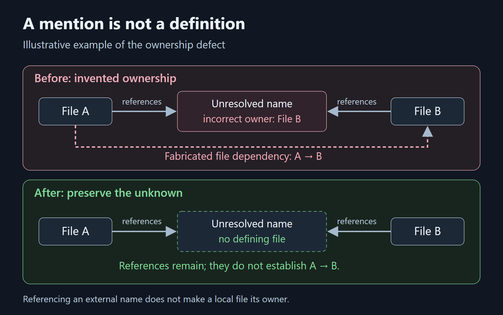

<!-- Publishing instructions and image manifest: README.md. Remove this comment before publishing. -->
<!-- Medium topics: Software Engineering; Debugging; Knowledge Graphs; Static Analysis; Programming. Select matching available topics. -->

# Your Code Graph Can Invent Dependencies

## We removed 743 phantom file dependencies without changing the measured retrieval score. That exposed a blind spot in our evaluation.

*By the [Nodesify](https://nodesify.com) team · October 2026*

*Disclosure: we build and maintain Astria. This is a defect in our own implementation, measured on our repository.*

## The results looked useful. The structure was wrong.

A codebase knowledge graph can locate relevant functions and still misrepresent how the repository fits together. At [Nodesify](https://nodesify.com), we encountered that problem while building [Astria](https://github.com/Nodesify/astria), our local graph builder for coding agents.

The defect involved unresolved names: symbols mentioned in source that have no definition in the indexed repository. Our graph represented those names with speculative nodes. That part was intentional. The mistake was assigning them a defining-file location borrowed from whichever file referenced the name first.

An unresolved `rusqlite` reference could therefore appear to belong to a source file that did not define it. When downstream analysis projected symbol relationships into file dependencies, that borrowed location became fabricated structure.

The fix removed **743 phantom file-to-file dependencies and four false file cycles** on our own repository. On the golden question set used for the check, the reported retrieval-quality output was byte-identical: **MRR 0.5979 before and after**. These are the [maintainer-recorded observations in the 1.1.0 changelog](https://github.com/Nodesify/astria/blob/c7789947c8d876aef6a66537ff0aa248560f3c08/CHANGELOG.md#L15-L20); they are separate from the October paired benchmark.

A useful retrieval score had failed to reveal a structural defect.

## How a borrowed location becomes a false dependency

Consider an illustrative example. File A references an external name. File B also references that name. The index has no local definition for it, so it creates an unresolved node.

If the node is incorrectly assigned to File B, analysis can turn A's reference into a dependency on B. Nothing in the source establishes that dependency; the graph invented it through ownership metadata.



*The file names are illustrative. A location where a name was referenced is not a location where it was defined.*

This distinction affects more than a displayed path. File dependency analysis can report false cycles. Hub detection and reports can promote files because of connections they do not actually own. `explain` can print a confident defining-file location for a symbol with no local definition.

The source occurrence remains useful evidence: it tells us that a file references a name. But it does not transfer ownership of that name to the file.

## The invariant we should have enforced

The fix in astria 1.1.0 enforces a simple invariant: speculative `stub` and `reference` nodes have **no defining source locus**. A whole-graph pass applies it on every build, and incremental updates clear stale locations from earlier graphs.

In simplified pseudocode, the ownership change is:

```text
Before: unresolved_node.source_file = referencing_file
After:  unresolved_node.source_file = ""

reference_edge.source_file = referencing_file
```

The reference occurrence retains its evidence; the unresolved target stops claiming that occurrence as a definition. This is an explanation of the change, not a verbatim patch.

The implementation also clears existing incorrect ownership with this SQL statement, reproduced from [the invariant pass](https://github.com/Nodesify/astria/blob/97a83dc605c154bea9362722107045fa843a9e74/crates/astria-build/src/crosslayer.rs#L84-L90):

```sql
UPDATE nodes SET source_file = ''
WHERE file_type IN ('stub', 'reference') AND source_file != ''
```

That pass runs before the other cross-layer linking passes. The [fix commit](https://github.com/Nodesify/astria/commit/97a83dc605c154bea9362722107045fa843a9e74) also changes node creation and downstream consumers; clearing one displayed path alone would not address the full defect.

`explain` now reports:

```text
(no source locus — unresolved name, no single owner)
```

That absence is meaningful information. The graph can identify the unresolved name and the relationships leading to it without claiming a definition that it never found.

The [release write-up's before/after table](https://github.com/Nodesify/astria/blob/c7789947c8d876aef6a66537ff0aa248560f3c08/website/blog/2026-10-06-astria-1-1-0.md#L26-L38) records the measured removals. Those observations come from our repository; they are not a universal estimate of how frequently graphs fabricate dependencies. The release record is a maintainer report, not a published raw before/after dataset.

## Syntax, binding, and inference are different evidence

A parser can observe a call expression without establishing which implementation it invokes. That gap matters in repositories with colliding names, unsupported imports, or runtime dispatch.

Astria records evidence classes on relationships:

- **EXTRACTED:** directly captured from syntax or structured input, such as file containment, a manifest dependency, or an ingested symbol index.
- **RESOLVED:** a call or import binding selected using names, scopes, and supported imports. It remains name inference rather than compiler resolution. A unique candidate can still be wrong.
- **INFERRED:** a deduced relationship, including unresolved call targets, embedding similarity, and connections learned from query history.
- **SEMANTIC:** a relationship produced by optional LLM enrichment.
- **AMBIGUOUS:** a plausible but unconfirmed relationship.
- **DECLARED:** externally declared evidence recognized by the engine, including externally assembled or merged graphs. The standard pipeline does not emit this class.

The labels describe the basis for a relationship. They do not guarantee it is correct or complete. A numeric score should likewise be interpreted according to how it was produced; an embedding similarity score is not proof of a call relationship.

Not every edge has a source line. Similarity can carry semantic provenance without a call site. An unresolved node can have a stable identifier without a defining file. Inspecting provenance means checking both the evidence that exists and the evidence that is absent.

## Stricter traversal is a tradeoff

You can restrict a query to directly extracted or externally declared relationships:

```sh
astria query "request authentication" --detail high
```

This keeps `EXTRACTED` and `DECLARED` edges while excluding name-derived `RESOLVED` calls too. The result can be easier to reason about, but it can omit useful connections. Strict filtering does not make an incomplete graph complete.

The same distinction matters for change impact. `affected` follows incoming dependency edges to find potential callers and other dependents. Its output is a review checklist, not runtime tracing. Missing bindings can hide impact; inferred edges can create false positives.

For a consequential relationship, inspect its evidence, follow its source location where available, and read the implementation before deciding what depends on what. The [graph-model reference](https://nodesify.github.io/astria/docs/reference/graph-model) describes the evidence contract.

Graphify's [confidence-tag explanation](https://graphify.com/blog/grounded-answers-confidence-tags) addresses the same reader need: understanding the basis of a relationship. Its labels belong to its own implementation; they should not be translated one-for-one into Astria's six evidence classes. Evidence labels help inspection, but this ownership bug shows why the underlying metadata must satisfy its own invariants too.

## What the unchanged score tells us

MRR—mean reciprocal rank—rewards retrieving a relevant result near the top. It evaluates ranking against the expected answers in a question set. It does not inspect every dependency in a graph.

An unchanged MRR therefore supports a narrow conclusion: the correction did not change that measured ranking result on that set. It does not establish that false edges were useless for ranking everywhere, or that all downstream analysis was unaffected.

The defect shows why retrieval and structural validation need separate attention. A query can find the right file even when unrelated ownership metadata is wrong. A graph can preserve every definition yet bind some references incorrectly. A correct answer to one question cannot certify the surrounding graph.

We now treat “this node has no local owner” as a property the system must preserve, not a display inconvenience to fill with a plausible path. The graph should distinguish a definition from a mention wherever consumers use that distinction.

## A map should preserve uncertainty

An unresolved name is not a failure that needs cosmetic repair. It is an honest boundary of the index. Keeping it unresolved lets a human or agent choose the next investigation: inspect an import, consult an external package, or verify a runtime path.

For code graphs, three checks answer different questions: retrieval metrics ask whether relevant results appear; structural invariants constrain what the graph may claim; source inspection establishes whether a particular relationship supports the proposed change.

Our bug passed the first check while violating the second. The fix made the graph more truthful without improving the reported retrieval score. That is still a meaningful improvement.

If you use Astria, inspect a relationship you can verify with `astria explain` and compare it with the [evidence contract](https://nodesify.github.io/astria/docs/reference/graph-model). If it claims an owner or binding the source does not support, report a minimal example through [Astria's issue tracker](https://github.com/Nodesify/astria/issues). Follow Nodesify on Medium for more engineering notes from the project.

## References and further reading

- [Give Your Coding Agent a Map](2026-10-give-your-coding-agent-a-map.md)
- [How We Evaluate Code Retrieval Tools](2026-10-how-we-evaluate-code-retrieval-tools.md)
- [Fix commit and implementation changes](https://github.com/Nodesify/astria/commit/97a83dc605c154bea9362722107045fa843a9e74)
- [Pinned 1.1.0 changelog: defect and unchanged MRR](https://github.com/Nodesify/astria/blob/c7789947c8d876aef6a66537ff0aa248560f3c08/CHANGELOG.md#L15-L20)
- [Pinned release write-up: before/after observations](https://github.com/Nodesify/astria/blob/c7789947c8d876aef6a66537ff0aa248560f3c08/website/blog/2026-10-06-astria-1-1-0.md#L26-L38)

*About Nodesify: [Nodesify](https://nodesify.com) is a Malaysia-based custom software development and IT consulting company, and the team behind [Astria](https://github.com/Nodesify/astria).*

*Astria is MIT-licensed and independently implemented, inspired by Graphify without affiliation or endorsement.*
