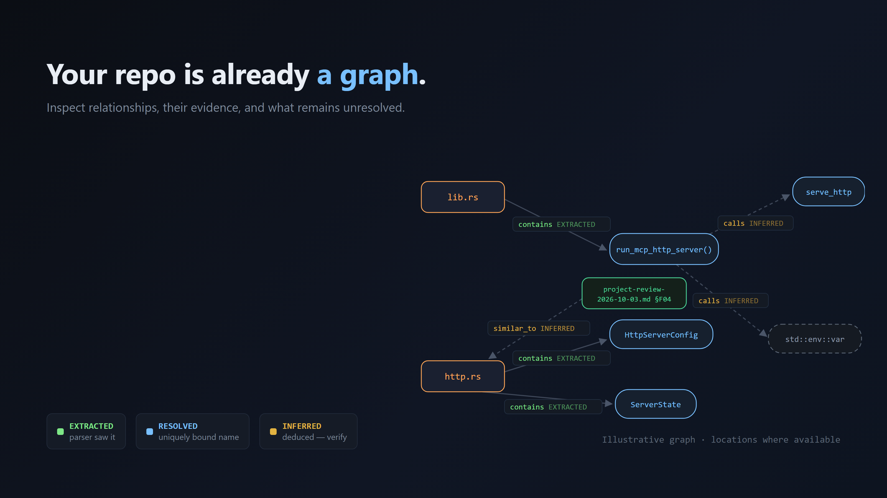
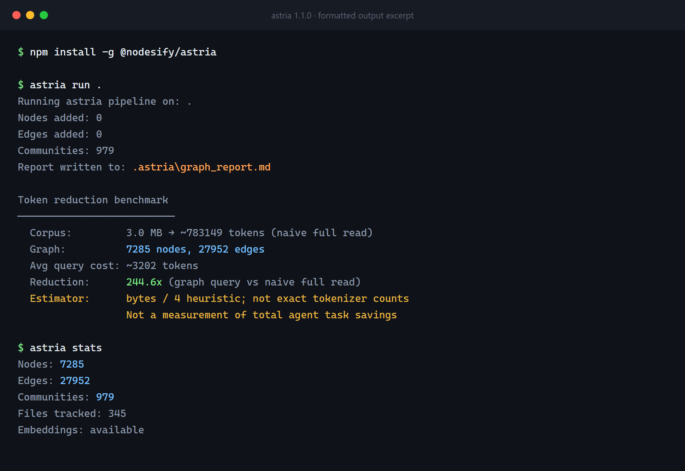
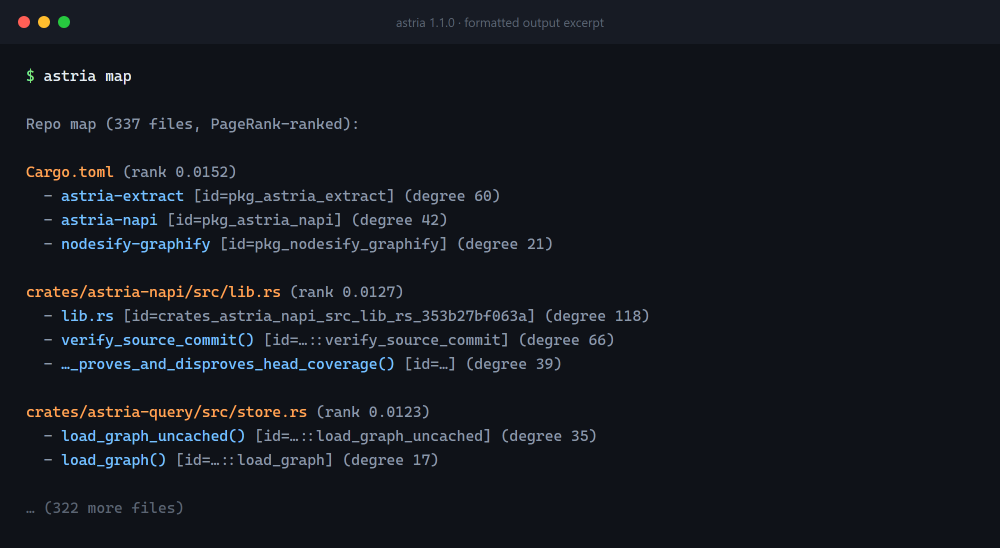
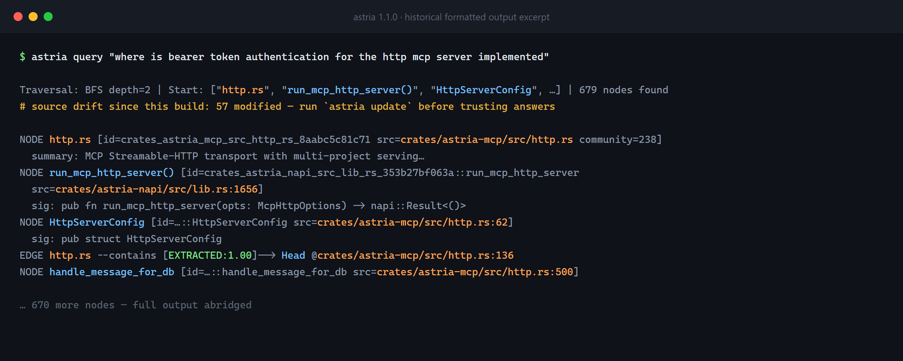
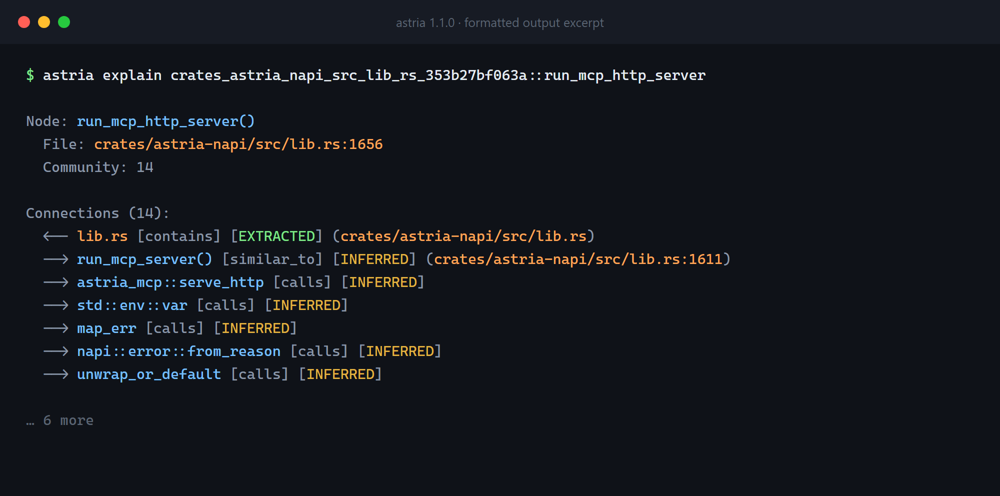
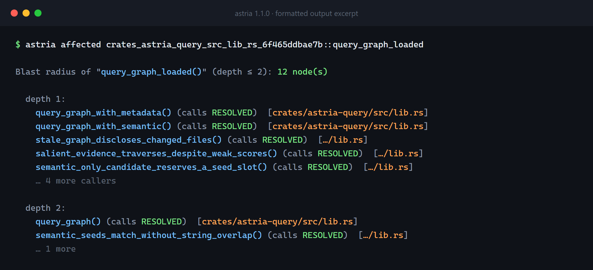
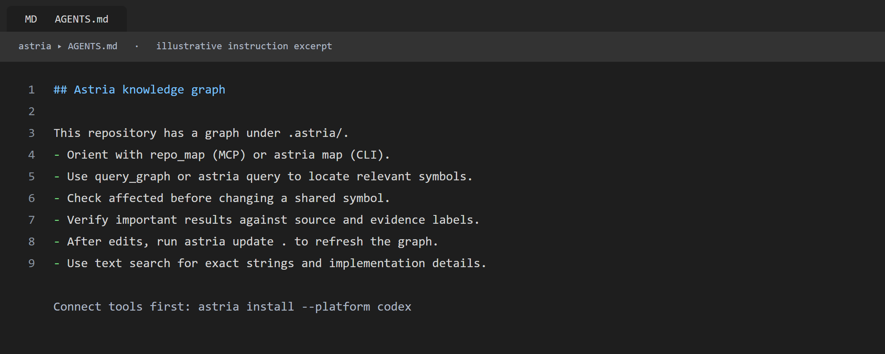

# Historical output reference

These formatted excerpts and illustrative assets supported the original article. They are retained as supporting documentation rather than inserted into the shorter series. They were rendered from HTML; they are not direct terminal or editor screenshots.

The recorded development graph contains 7,285 nodes and 27,952 edges across 345 tracked files, with 979 communities. The October paired evaluation used a different pinned corpus. These historical counts need not match the current local graph.

## Original relationship illustration

The diagram illustrates evidence classes; it is not a complete graph export. The new introduction uses a smaller diagram to focus on three relationships.

## Build and statistics excerpt

“Nodes added: 0” indicates reuse of an existing graph. The 244.6× figure uses a bytes÷4 heuristic to compare estimated full-corpus size with average matching sample-query output. It does not measure targeted-search savings or total agent task cost. The highlighted estimator explanation is an editorial annotation.

## Orientation excerpt

Ranks orient the reader toward connected files. They do not certify architecture boundaries or runtime importance.

## Query and source drift excerpt

This illustrates stale-source disclosure. Refresh the graph before trusting its relationships, and use current IDs and locations in a new investigation.

## Evidence excerpt

Evidence labels distinguish directly observed structure from name-derived or similarity-based connections. Unresolved targets need not have defining source locations.

## Impact excerpt

This is reverse graph reachability, not runtime tracing. Displayed locations identify referencing files rather than exact call-site line numbers.

## Agent instruction example

The instruction block describes behavior. Register the tools separately, for example through `astria install --platform codex`, before expecting MCP access.
