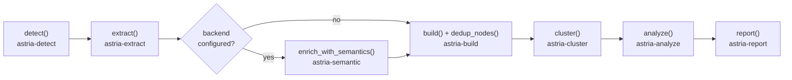

# Architecture

astria turns source code into a queryable knowledge graph. It uses AST-based extraction via tree-sitter for deterministic, fast analysis, stored in a SQLite database.

The project is a Rust workspace with 15 domain-specific crates and a Node.js CLI package.

- **Language**: Rust 2021
- **Build system**: Cargo + npm
- **Core dependencies**: `rusqlite` (persistence), `tree-sitter` (AST parsing), `petgraph` (graph algorithms), `napi-rs` (Node.js bindings), `fastembed` (local embeddings)

## Pipeline

The pipeline is orchestrated in `crates/astria-napi/src/pipeline.rs`. Validation runs before graph assembly: every node needs id/label/file_type/source_file, every edge needs existing endpoints and a valid confidence class — a corrupted extraction fails the run with the full violation list (`diagnose` reports the same classes of problem read-only on an existing graph).

1. **detect()** (`astria-detect`): Discovers files, classifies them (Code, Document, etc.), and uses a SHA-256 manifest to identify changed files since the last run. Manifest ingestion also covers dependency manifests — including Cargo workspace members and internal path dependencies (`crate::*` nodes with `crate_depends_on` edges).
2. **extract()** (`astria-extract`): Performs AST-based extraction using tree-sitter. Supports 21 languages with per-language configurations in `src/langs/`.
3. **enrich_with_semantics()** (`astria-semantic`, optional): When an LLM backend is configured, extracts topics, concepts, and entities (including from images via vision) concurrently and caches the results.
4. **build()** (`astria-build`): Merges extracted nodes and edges into the SQLite graph database, handles deduplication and cross-file reference resolution.
5. **cluster()** (`astria-cluster`): Performs community detection using the deterministic label propagation algorithm (via `petgraph`) and updates the `community` attribute on nodes.
6. **analyze()** (`astria-analyze`): Analyzes the graph to find "god nodes" (call stubs excluded), surprising cross-community connections, blast radius, and generates suggested questions.
7. **report()** (`astria-report`): Generates a plain-language `graph_report.md` summarizing the graph's structure and insights.

Each stage is a pure function in its own crate; semantic enrichment is optional and activates when an LLM backend is configured.

## Crate responsibilities

| Crate | Responsibility |
| :--- | :--- |
| `astria-core` | Shared types (`FileType`, `GraphStats`), `AstriaError`, SQLite schema + migrations, path validation, sanitization, sensitive-path denylist. |
| `astria-paths` | Path normalization and `.astria` directory management. |
| `astria-detect` | File system scanning, `.astriaignore` support, and incremental change detection via SHA-256 hashes. |
| `astria-extract` | Tree-sitter AST traversal logic. Each language defines its own extraction rules (nodes, edges, docstrings). |
| `astria-embed` | Local embedding model (fastembed/ONNX, `bge-small-en-v1.5`) powering `similar_to` edges and embedding-backed query recall — no API key, offline after the first model download. |
| `astria-build` | Persistent graph assembly; entity dedup (MinHash/LSH blocking + Jaro-Winkler verify) in `dedup.rs`. |
| `astria-cluster` | Deterministic community detection (stable labels, cohesion, modularity) using `petgraph`. |
| `astria-analyze` | God nodes, ranked surprising cross-community connections, blast radius (`affected.rs`, reverse reachability). |
| `astria-query` | Query engine: BFS/DFS (optionally directed), shortest path, explain, token-based node scoring, per-path graph cache. |
| `astria-mcp` | MCP stdio server exposing the graph to AI agents. |
| `astria-report` | Markdown generation for the final user-facing report. |
| `astria-semantic` | LLM semantic extraction, multi-backend (Claude / OpenAI-compatible / Gemini) with vision, chunking, and output validation. |
| `astria-ingest` | URL ingestion (arXiv/tweet/webpage/image) with SSRF protection: scheme allowlist, per-hop redirect re-validation (manual redirect following), DNS-resolved address blocking (private/CGNAT/link-local, IPv4+IPv6), and slugified download filenames. |
| `astria-pdf` | PDF text extraction. |
| `astria-napi` | The bridge between Rust and Node.js: pipeline orchestration, query surface, merge/diff, JSON/HTML/GraphML/tree export. |
| `astria-cli` *(Node.js package)* | The user-facing CLI: argument parsing and installing AI skills. |

## Data model

### SQLite schema

The graph is stored in `.astria/db.sqlite` with the following tables:

- `nodes`: `id`, `label`, `file_type`, `source_file`, `source_line`, `docstring`, `community`
- `edges`: `source`, `target`, `relation`, `confidence`, `confidence_score`, `source_file`, `source_line`, `context`
- `hyperedges`: `id`, `label`, `nodes` (json array), `relation`, `confidence`, `confidence_score`, `source_file` — n-ary groups produced deterministically (see below)
- `communities`: detected community labels and cohesion scores
- `file_manifest`: `path`, `hash`, `last_extracted_at` — used for incremental updates
- `extraction_cache`: cached per-file extraction results keyed by content hash
- `pipeline_runs`: one row per pipeline run (stage timing, version stamp)
- `query_history`: `question`, `answer`, `queried_at`
- `_meta`: schema version and other bookkeeping

### Relationship types

- `Calls` — function or method invocation
- `Imports` — module or file level dependency
- `Uses` — variable or type usage
- `Defines` — containment (e.g., class defines a method)
- `Inherits` — class inheritance or interface implementation

Hyperedge relations (n-ary, deterministic producers — no LLM):

- `participate_in` — a community's top-degree members grouped as one hyperedge
- `shares_reference` — files referencing the same identifier-shaped literal (≥ 3 distinct files)

Ingest also contributes relation families when the relevant inputs exist: `crate_depends_on` (Cargo workspace topology), `requires_env` (MCP configs, env names only), `scip_impl`/`scip_typed`/`scip_def`/`scip_ref` (SCIP indexes), and `same_type_as` plus cross-repo call edges (global graph).

## Persistence and performance

- **SQLite** — chosen for its zero-config nature and robust ACID properties, making it perfect for local analysis.
- **Incremental rebuilds** — the system only re-extracts files that have changed, drastically reducing analysis time for large projects.
- **napi-rs** — provides near-native performance for the CLI while maintaining the ease of use of an npm package.
