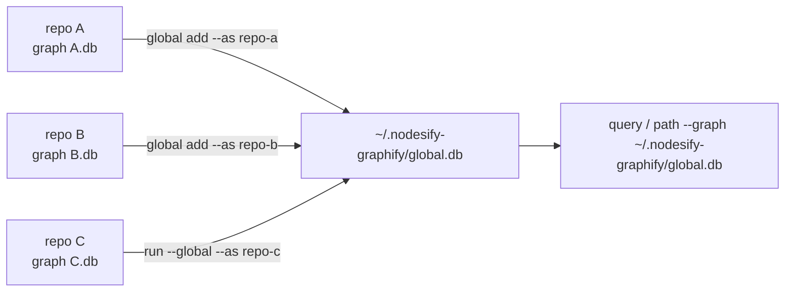

# Global graph (cross-repo)

Individual graphs answer questions within one repo. The global graph merges many repo graphs into a single queryable store at `~/.nodesify-graphify/global.db` — so "where is the shared auth type used?" works across service boundaries.



## Build and merge

```bash
nodesify-graphify run <path> --global --as <tag>   # build, then merge into the global store
nodesify-graphify global add <path> [--as <tag>]   # same merge, standalone (idempotent per tag)
nodesify-graphify global remove <tag>              # prune a repo from the global graph
nodesify-graphify global list                      # registered repos
nodesify-graphify global path <A> <B>              # shortest path across repos
```

## Query the merged store

The usual `--graph` flag works against the global db:

```bash
nodesify-graphify query "where is the shared auth type" --graph ~/.nodesify-graphify/global.db
```

## How merging behaves

- **Sourced ids** — node ids from a repo are prefixed with its tag (`<tag>::<id>`), so every repo's private symbols stay distinct.
- **Shared externals dedupe** — external/stub symbols stay unprefixed and dedupe by label, so `serde_json::Value` means the same thing in every repo.
- **Type unification** — types sharing `(namespace, label)` across repos get `same_type_as` edges.
- **Cross-repo call resolution** — parked unresolved calls are resolved when exactly one cross-repo candidate exists, and **fail closed on ambiguity**: two same-named candidates means no edge, never a guess.

## When to reach for it

- Microservices or libraries that share types and call across repos.
- A monorepo of many packages graphed per-package for speed.
- Tracing "what else consumes this API?" beyond one repository's imports.
