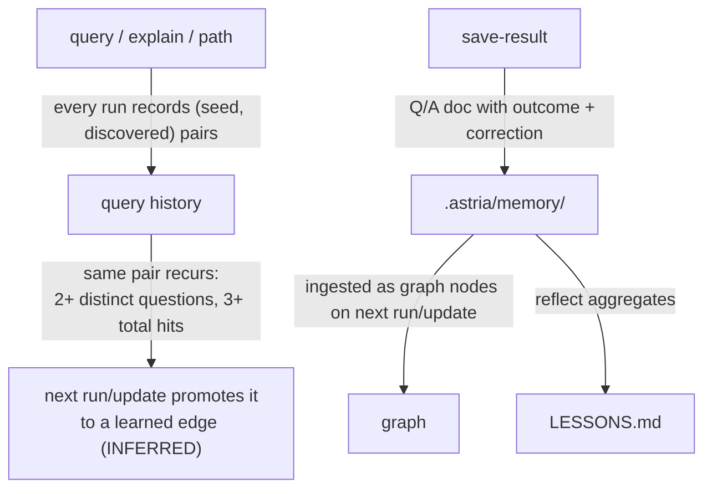

# Memory and learning

The graph compounds in value as you use it, through two independent loops: **learned edges** (automatic) and **curated memory** (deliberate).



## Learned edges — automatic

Every query records which (seed, discovered) node pairs its traversal connected. When the same pair recurs across **at least 2 distinct questions with 3+ total hits**, the next `run`/`update` promotes it to a `learned` edge — `INFERRED`, hits-scored, provenance `query_history`.

Learned edges flow into clustering, analysis, and every export — the graph remembers which connections you actually keep asking about. High-fidelity traversals (`--detail high`) filter them like any other `INFERRED` fact.

## Curated memory — deliberate

Learned edges are automatic; memory is curated. You decide which answers are worth keeping:

```bash
astria save-result "where is rate limiting?" \
    --answer "BucketMiddleware in src/limiter.rs" \
    --outcome useful \
    --nodes <cited-node-ids>
astria reflect
```

- `save-result` writes a Q/A memory doc (with an outcome — `useful`, `dead_end`, or `corrected` — and optional corrections) into `.astria/memory/`. Cited node ids link the answer back to the graph.
- The next `run`/`update` ingests memory docs as graph nodes, so settled questions become part of the graph itself.
- `reflect` aggregates outcomes into `.astria/reflections/LESSONS.md` with tallies — a running record of which answers held up.

## Why two loops

Learned edges capture *what you ask about* without any ceremony; memory captures *what you settled*, including corrections to earlier wrong answers. Together they mean the graph you have after a month of work is measurably more useful than the one a fresh `run` builds.
