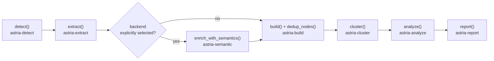

# Architecture

astria turns source code into a queryable knowledge graph. It uses AST-based extraction via tree-sitter for deterministic, fast analysis, stored in a SQLite database.

The project is a Rust workspace with 16 domain-specific crates and a Node.js CLI package.

- **Language**: Rust 2021
- **Build system**: Cargo + npm
- **Core dependencies**: `rusqlite` (persistence), `tree-sitter` (AST parsing), `petgraph` (graph algorithms), `napi-rs` (Node.js bindings), `fastembed` (local embeddings)

## Pipeline

The pipeline is orchestrated in `crates/astria-napi/src/pipeline.rs`. Validation runs before graph assembly: every node needs id/label/file_type/source_file, every edge needs existing endpoints and a valid confidence class — a corrupted extraction fails the run with the full violation list (`diagnose` reports the same classes of problem read-only on an existing graph).

1. **detect()** (`astria-detect`): Discovers files, classifies them (Code, Document, etc.), and uses a SHA-256 manifest to identify changed files since the last run. Manifest ingestion also covers dependency manifests — including Cargo workspace members and internal path dependencies (`crate::*` nodes with `crate_depends_on` edges).
2. **extract()** (`astria-extract`): Performs AST-based extraction using tree-sitter. Uses 25 registered language configurations; discovery and parser selection share `astria-core/src/languages.rs`, with AST rules in `src/langs/`.
3. **enrich_with_semantics()** (`astria-semantic`, optional): When `--backend` or `ASTRIA_LLM_BACKEND` explicitly selects a backend, extracts topics, concepts, and entities (including from images via vision) concurrently and caches the results.
4. **build()** (`astria-build`): Publishes extracted nodes and edges into SQLite. The extraction reference pass reconciles cross-file references before publication; deduplication runs as a derived pass.
5. **cluster()** (`astria-cluster`): Performs community detection using the deterministic label propagation algorithm (via `petgraph`) and updates the `community` attribute on nodes.
6. **analyze()** (`astria-analyze`): Analyzes the graph to find "god nodes" (call stubs excluded), surprising cross-community connections, blast radius, and generates suggested questions.
7. **report()** (`astria-report`): Generates a plain-language `graph_report.md` summarizing the graph's structure and insights.

Pipeline stages separate extraction, persistence, and derived outputs. Semantic enrichment requires explicit backend selection; credentials alone do not activate it.

## Update and query consistency

AST parsing is incremental: unchanged source reuses its versioned extraction cache. The extraction reference pass reconciles the complete current corpus, so adding, removing, or renaming a definition also updates callers from unchanged files. Name-based resolution is still `INFERRED`; deterministic execution does not make a guessed target a declared fact.

Validated file-owned graph facts, the file manifest, and `_meta.graph_published_at` commit in one SQLite transaction. Query freshness (`graph_built_at`) uses that publication timestamp, so a failed later stage does not hide a successful core publication. The build configuration fingerprint includes deduplication options; changing those options triggers reconciliation. Extraction or semantic extraction errors leave that core graph and manifest unadvanced. Derived passes run after the core commit and rerun on subsequent updates, including unchanged updates, so a failed derived pass can be retried. These later passes and exported files are not part of the core transaction.

Semantic caches include source inputs and non-secret effective backend, endpoint, model, and prompt configuration. Cached and fresh semantic results use the same merge path. Community labels and deep links also fingerprint their effective inputs and configuration. Source changes invalidate deep edges; restoring them requires another run with `--deep`, which replays matching cache entries or generates fresh links.

CLI and MCP queries use the same hybrid retrieval path. Each request loads a fresh SQLite graph snapshot in O(V + E) time and memory instead of reusing a process-global graph cache. `--detail high` filters on evidence kind (`EXTRACTED`), independent of usage-adjusted scores; learned, name-resolved, and semantic edges remain inferred.

## Crate responsibilities

| Crate | Responsibility |
| :--- | :--- |
| `astria-bolt` | Bolt client for exporting the graph to a live Neo4j database. |
| `astria-core` | Shared types (`FileType`, `GraphStats`), `AstriaError`, SQLite schema + migrations, path validation, sanitization, sensitive-path denylist. |
| `astria-paths` | Path normalization and `.astria` directory management. |
| `astria-detect` | File system scanning, `.astriaignore` support, and incremental change detection via SHA-256 hashes. |
| `astria-extract` | Tree-sitter AST traversal logic. Each language defines its own extraction rules (nodes, edges, docstrings). |
| `astria-embed` | Local embedding model (fastembed/ONNX, `bge-small-en-v1.5`) powering `similar_to` edges and embedding-backed query recall — no API key, offline after the first model download. |
| `astria-build` | Persistent graph assembly; entity dedup (MinHash/LSH blocking + Jaro-Winkler verify) in `dedup.rs`. |
| `astria-cluster` | Deterministic community detection (stable labels, cohesion, modularity) using `petgraph`. |
| `astria-analyze` | God nodes, ranked surprising cross-community connections, blast radius (`affected.rs`, reverse reachability). |
| `astria-query` | Query engine: BFS/DFS (optionally directed), shortest path, explain, token-based node scoring, fresh SQLite snapshot per request (no process-global graph cache). |
| `astria-mcp` | MCP stdio server exposing the graph to AI agents. |
| `astria-report` | Markdown generation for the final user-facing report. |
| `astria-semantic` | LLM semantic extraction, multi-backend (Claude / OpenAI-compatible / Gemini) with vision, chunking, and output validation. |
| `astria-ingest` | URL ingestion (arXiv/tweet/webpage/image) with SSRF protection: scheme allowlist, per-hop redirect re-validation (manual redirect following), DNS-resolved address blocking (private/CGNAT/link-local, IPv4+IPv6), and slugified download filenames. |
| `astria-pdf` | PDF text extraction. |
| `astria-napi` | The bridge between Rust and Node.js: pipeline orchestration, query surface, merge/diff, JSON/HTML/GraphML/SVG/tree/Cypher export, live Neo4j push, and health and risk reports. |
| `astria-cli` *(Node.js package)* | The user-facing CLI: argument parsing and installing AI skills. |

## Data model

### SQLite schema

The graph is stored in `.astria/db.sqlite` with the following tables:

- `nodes`: `id`, `label`, `file_type`, `source_file`, `source_line`, `docstring`, `community`
- `edges`: `source`, `target`, `relation`, `confidence`, `confidence_score`, `source_file`, `source_line`, `context`
- `hyperedges`: `id`, `label`, `nodes` (json array), `relation`, `confidence`, `confidence_score`, `source_file` — n-ary groups produced deterministically (see below)
- `communities`: detected community labels and cohesion scores
- `file_manifest`: `path`, `hash`, `last_extracted_at` — used for incremental updates
- `extraction_cache`: cached per-file extraction results keyed by content hash
- `pipeline_runs`: one row per pipeline run (stage timing, version stamp)
- `query_history`: `question`, `answer`, `queried_at`
- `_meta`: schema version and other bookkeeping

### Relationship types

- `calls` — invocation syntax; resolved name-based targets remain inferred
- `imports` — module or file dependency
- `contains` — structural containment
- `inherits`, `implements`, `uses` — relationships where extraction or the semantic layer exposes them

See the [graph model](../reference/graph-model) for evidence classes and the [generated language table](../reference/language-support) for configured AST kinds. The registry supplies discovered extensions and parser selection; registration does not promise complete semantic support.

Hyperedge relations (n-ary, deterministic producers — no LLM):

- `participate_in` — a community's top-degree members grouped as one hyperedge
- `shares_reference` — files referencing the same identifier-shaped literal (≥ 3 distinct files)

Ingest also contributes relation families when the relevant inputs exist: `crate_depends_on` (Cargo workspace topology), `requires_env` (MCP configs, env names only), `scip_impl`/`scip_typed`/`scip_def`/`scip_ref` (SCIP indexes), and `same_type_as` plus cross-repo call edges (global graph).

## Persistence and performance

- **SQLite** — chosen for its zero-config nature and robust ACID properties, making it perfect for local analysis.
- **Incremental rebuilds** — AST parsing reuses unchanged cached files; reference reconciliation still considers the complete current corpus.
- **napi-rs** — provides near-native performance for the CLI while maintaining the ease of use of an npm package.
